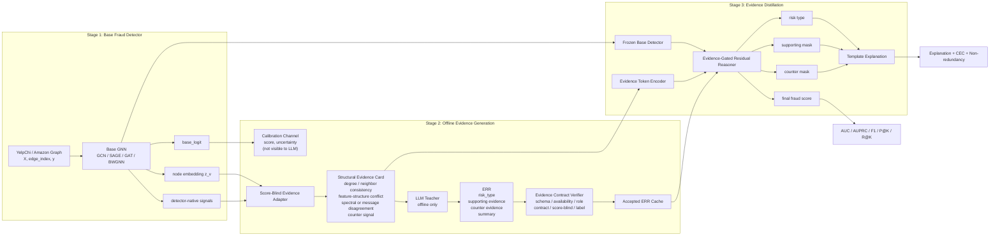

# CoVER-FD：合同验证结构证据蒸馏方法设计

---

## 1. 方法定位

原表述：

> 基于结构证据提示与生成判别协同的可解释推理方法。

改为：

> 基于合同验证结构证据蒸馏的可解释虚假评论检测方法。

英文名：

> **CoVER-FD: Contract-Verified Evidence Distillation for LLM-Free Fake Review Detection**

三点创新保留并微调：

1. **SEC → Score-Blind Structural Evidence Card**
   把图结构差异、邻居一致性、特征-结构冲突、频域/聚合异常等转成 score-blind evidence card。LLM 看不到 base score，只能看结构证据。

2. **ECR → Evidence Contract Verification**
   LLM 只生成结构化 ERR，不信任自由文本。ERR 必须通过 schema、availability、role、contract、score-blind、label-compatibility 检查才进入训练。CoVER 文档本身也强调 LLM 只作 offline evidence generator，生成结果必须通过 evidence contracts 才能蒸馏到学生 GNN。

3. **TCA → Signed Evidence Distillation + Evidence-Gated Residual Reasoner**
   不再做复杂"三分支大模型微调"，而是做轻量三头：risk type head、positive evidence mask head、negative evidence mask head，再用 residual readout 修正 base logit。学生 reasoner 输出 final logit、reason type、正负 evidence mask，并保持推理阶段 LLM-free。

DuoKD 的价值在此非常明确：它强调正负知识同时建模，正信号增强 intra-class consistency，负信号增强 inter-class distinctiveness，并用过滤机制降低 LLM 噪声。fraud 场景可以把 DuoKD 的 positive/negative knowledge 改写为 **supporting evidence / counter evidence**，比直接照搬语义 rationale 更贴合虚假评论检测。

---

## 2. 论文方法图草案



图中需突出两个红色禁止符号：

```text
No score in LLM prompt
No LLM during inference
```

这是和普通 LLM-GNN / post-hoc XAI 拉开差异的核心。

---

## 3. 最小可行代码架构

```text
cover_fd/
├── configs/
│   ├── yelpchi_bwgnn.yaml
│   ├── amazon_bwgnn.yaml
│   ├── yelpchi_gcn.yaml
│   ├── scarcity_10.yaml
│   └── ablations.yaml
├── data/
│   ├── load_fraud.py
│   └── split.py
├── models/
│   ├── gnn.py
│   ├── bwgnn.py
│   └── reasoner.py
├── evidence/
│   ├── adapter.py
│   ├── schema.py
│   ├── contracts.yaml
│   ├── verifier.py
│   └── prompt.py
├── train_stage1.py
├── generate_stage2_err.py
├── train_stage3_reasoner.py
├── eval.py
├── run_ablation.py
├── run_scarcity.py
└── utils.py
```

保留 12 个文件左右。目标不是开源平台，而是 **论文结果可信、代码能跑、结构清楚**。

---

## 4. 核心代码骨架

### 4.1 Evidence schema

```python
# evidence/schema.py
from dataclasses import dataclass
from typing import Dict, List, Optional


@dataclass
class CalibrationChannel:
    base_score: float
    uncertainty: float


@dataclass
class ReasoningChannel:
    degree_level: str
    neighbor_consistency: str
    feature_neighbor_discrepancy: str
    detector_signal: str
    detector_signal_strength: str
    counter_signal: str
    allowed_support_ids: List[str]
    allowed_counter_ids: List[str]

    def to_dict(self) -> Dict:
        return self.__dict__


@dataclass
class EvidenceCard:
    node_id: int
    detector_name: str
    calibration: CalibrationChannel
    reasoning: ReasoningChannel

    def to_teacher_payload(self) -> Dict:
        # 严禁泄露 base_score / uncertainty raw value
        return {
            "node_id": self.node_id,
            "detector_name": self.detector_name,
            "reasoning": self.reasoning.to_dict(),
        }


@dataclass
class ERR:
    node_id: int
    risk_type: str
    supporting_evidence: List[str]
    counter_evidence: List[str]
    summary: str
```

直接实现 CoVER 的 score-blind MEP 思路：calibration channel 只做 trace selection，teacher payload 只能包含 reasoning channel。

---

### 4.2 Evidence adapter

```python
# evidence/adapter.py
import torch
import torch.nn.functional as F
from .schema import CalibrationChannel, ReasoningChannel, EvidenceCard


def bucketize(x, q1, q2):
    if x <= q1:
        return "low"
    if x <= q2:
        return "medium"
    return "high"


class EvidenceAdapter:
    def __init__(self, detector_name: str, edge_index: torch.Tensor, x: torch.Tensor):
        self.detector_name = detector_name
        self.edge_index = edge_index
        self.x = x

    @torch.no_grad()
    def extract(self, node_ids, base_logits, z, extra=None):
        prob = torch.sigmoid(base_logits).view(-1)
        uncertainty = 1.0 - torch.abs(prob - 0.5) * 2.0

        deg = torch.bincount(self.edge_index[0], minlength=self.x.size(0)).float()
        deg_q1, deg_q2 = torch.quantile(deg, torch.tensor([0.33, 0.66], device=deg.device))

        cards = []
        for v in node_ids.tolist():
            neigh = self.edge_index[1][self.edge_index[0] == v]
            if neigh.numel() == 0:
                neigh_cons = "low"
                feat_disc = "high"
            else:
                zv = F.normalize(z[v:v+1], dim=-1)
                zn = F.normalize(z[neigh], dim=-1).mean(dim=0, keepdim=True)
                sim = F.cosine_similarity(zv, zn).item()
                neigh_cons = "high" if sim > 0.6 else "medium" if sim > 0.3 else "low"

                xv = F.normalize(self.x[v:v+1].float(), dim=-1)
                xn = F.normalize(self.x[neigh].float(), dim=-1).mean(dim=0, keepdim=True)
                fsim = F.cosine_similarity(xv, xn).item()
                feat_disc = "high" if fsim < 0.2 else "medium" if fsim < 0.5 else "low"

            detector_signal = self._detector_signal(v, extra)
            counter_signal = "benign_neighbor_signal_high" if neigh_cons == "high" else "benign_neighbor_signal_low"

            reasoning = ReasoningChannel(
                degree_level=bucketize(deg[v], deg_q1, deg_q2),
                neighbor_consistency=neigh_cons,
                feature_neighbor_discrepancy=feat_disc,
                detector_signal=detector_signal,
                detector_signal_strength="strong" if detector_signal.endswith("high") else "moderate",
                counter_signal=counter_signal,
                allowed_support_ids=[
                    "degree_level",
                    "neighbor_consistency",
                    "feature_neighbor_discrepancy",
                    "detector_signal",
                    "detector_signal_strength",
                ],
                allowed_counter_ids=["counter_signal"],
            )

            cards.append(EvidenceCard(
                node_id=int(v),
                detector_name=self.detector_name,
                calibration=CalibrationChannel(
                    base_score=float(prob[v].item()),
                    uncertainty=float(uncertainty[v].item()),
                ),
                reasoning=reasoning,
            ))
        return cards

    def _detector_signal(self, v, extra):
        if self.detector_name.lower() == "bwgnn" and extra is not None:
            val = extra["high_freq_response"][v].item()
            return "high_frequency_response_high" if val > extra["hf_thr"] else "high_frequency_response_medium"
        return "embedding_neighbor_discrepancy_high"
```

第一版先做 `generic + detector_signal + counter_signal`，BWGNN 只需暴露一个高频响应或 band-pass activation。

---

### 4.3 Contract verifier

```python
# evidence/verifier.py
SCORE_KEYS = {
    "score", "base_score", "prediction_score",
    "prob", "probability", "logit", "confidence"
}

VALID_RISK_TYPES = {
    "structural_discrepancy",
    "camouflage_neighbor",
    "spectral_anomaly",
    "feature_structure_conflict",
    "relation_or_burst_anomaly",
    "weak_or_uncertain_evidence",
}


class EvidenceContractVerifier:
    def __init__(self, contracts: dict):
        self.contracts = contracts

    def verify(self, err, card, label=None):
        reasons = []
        rea = card.reasoning.to_dict()

        if err.risk_type not in VALID_RISK_TYPES:
            reasons.append("invalid_risk_type")

        cited = set(err.supporting_evidence) | set(err.counter_evidence)
        available = set(rea.keys())
        if not cited <= available:
            reasons.append("unavailable_evidence")

        if not set(err.supporting_evidence) <= set(rea["allowed_support_ids"]):
            reasons.append("invalid_support_role")
        if not set(err.counter_evidence) <= set(rea["allowed_counter_ids"]):
            reasons.append("invalid_counter_role")
        if set(err.supporting_evidence) & set(err.counter_evidence):
            reasons.append("overlap_support_counter")

        if cited & SCORE_KEYS:
            reasons.append("score_leakage")

        if not self._satisfy_contract(err, rea):
            reasons.append("contract_violation")

        # 可选：benign 节点不允许强 fraud reason，除非 weak/uncertain
        if label == 0 and err.risk_type in {"spectral_anomaly", "camouflage_neighbor"}:
            reasons.append("label_incompatible")

        return len(reasons) == 0, reasons

    def _satisfy_contract(self, err, rea):
        spec = self.contracts.get(err.risk_type, {})
        required_any = spec.get("required_any", [])
        if not required_any:
            return True

        for cond in required_any:
            field = cond["field"]
            values = cond["values"]
            if field in err.supporting_evidence and rea.get(field) in values:
                return True
        return False
```

这是论文可信度核心。verifier 定位为确定性 hard gate，检查 schema、availability、role、contract、score-blindness 和 label compatibility。

---

### 4.4 Reasoner

```python
# models/reasoner.py
import torch
import torch.nn as nn
import torch.nn.functional as F


class EvidenceEncoder(nn.Module):
    def __init__(self, num_slots, num_values, emb_dim=16, out_dim=64):
        super().__init__()
        self.emb = nn.Embedding(num_values, emb_dim)
        self.proj = nn.Sequential(
            nn.Linear(num_slots * emb_dim, out_dim),
            nn.ReLU(),
            nn.LayerNorm(out_dim),
        )

    def forward(self, evidence_token_ids):
        h = self.emb(evidence_token_ids)
        h = h.flatten(start_dim=1)
        return self.proj(h)


class EvidenceReasoner(nn.Module):
    def __init__(self, z_dim, num_slots, num_values, num_types, hidden=128, rho=0.3):
        super().__init__()
        self.evi_encoder = EvidenceEncoder(num_slots, num_values)
        in_dim = z_dim + 64
        self.shared = nn.Sequential(
            nn.Linear(in_dim, hidden),
            nn.ReLU(),
            nn.Dropout(0.3),
        )
        self.type_head = nn.Linear(hidden, num_types)
        self.pos_head = nn.Linear(hidden, num_slots)
        self.neg_head = nn.Linear(hidden, num_slots)
        self.residual = nn.Linear(hidden, 1)
        self.rho = rho

    def forward(self, z, base_logit, evidence_token_ids):
        g = self.evi_encoder(evidence_token_ids)
        h = self.shared(torch.cat([z, g], dim=-1))

        type_logits = self.type_head(h)
        pos_logits = self.pos_head(h)
        neg_logits = self.neg_head(h)

        gate = torch.sigmoid(pos_logits).mean(dim=-1, keepdim=True) - \
               torch.sigmoid(neg_logits).mean(dim=-1, keepdim=True)

        residual_logit = gate * self.residual(h)
        final_logit = base_logit.view(-1, 1) + self.rho * residual_logit

        return {
            "final_logit": final_logit.view(-1),
            "type_logits": type_logits,
            "pos_logits": pos_logits,
            "neg_logits": neg_logits,
        }
```

final fraud logit 为 `base_logit + rho * residual_logit`，`rho=0` 可退化为 base detector，用于 ablation 和 CEC。

---

### 4.5 Stage 3 loss

```python
# train_stage3_reasoner.py
def compute_loss(out, y, targets, accepted_mask, pos_weight, lambda_evi=0.5):
    task_loss = F.binary_cross_entropy_with_logits(
        out["final_logit"], y.float(), pos_weight=pos_weight
    )

    if accepted_mask.sum() == 0:
        return task_loss, {"task": task_loss.item(), "type": 0.0, "evi": 0.0}

    idx = accepted_mask.bool()
    type_loss = F.cross_entropy(out["type_logits"][idx], targets["risk_type"][idx])
    pos_loss = F.binary_cross_entropy_with_logits(out["pos_logits"][idx], targets["pos_mask"][idx].float())
    neg_loss = F.binary_cross_entropy_with_logits(out["neg_logits"][idx], targets["neg_mask"][idx].float())
    evi_loss = type_loss + pos_loss + neg_loss

    return task_loss + lambda_evi * evi_loss, {
        "task": task_loss.item(),
        "type": type_loss.item(),
        "evi": evi_loss.item(),
    }
```

训练目标：

$$\mathcal{L} = \mathcal{L}_{\text{sup}} + \lambda_{\text{evi}} \cdot \mathbb{1}[a_v=1](\mathcal{L}_{\text{type}} + \mathcal{L}_{\text{pos-mask}} + \mathcal{L}_{\text{neg-mask}})$$

rejected ERR 不污染训练。

---

## 5. 最快实现路径

### Phase A：先跑通无 LLM 的完整 pipeline

用规则生成伪 ERR：

```text
if detector_signal == high_frequency_response_high:
    risk_type = spectral_anomaly
    supporting = ["detector_signal", "detector_signal_strength"]
    counter = ["counter_signal"]
elif feature_neighbor_discrepancy == high:
    risk_type = feature_structure_conflict
...
```

2 天内完成：

```bash
python train_stage1.py --dataset yelpchi --model bwgnn
python generate_stage2_err.py --dataset yelpchi --teacher rule
python train_stage3_reasoner.py --dataset yelpchi --model bwgnn
python eval.py --dataset yelpchi
```

目标不是创新，而是检查：

```text
base AUC/AUPRC 是否正常
ERR acceptance rate 是否 > 60%
reasoner 是否不崩
rho=0 是否等于 base
no-counter / no-verifier ablation 是否能跑
```

### Phase B：接入 LLM offline teacher

LLM 输入只给 JSON：

```json
{
  "node_id": 123,
  "detector_name": "BWGNN",
  "reasoning": {
    "degree_level": "high",
    "neighbor_consistency": "low",
    "feature_neighbor_discrepancy": "high",
    "detector_signal": "high_frequency_response_high",
    "detector_signal_strength": "strong",
    "counter_signal": "benign_neighbor_signal_low",
    "allowed_support_ids": ["..."],
    "allowed_counter_ids": ["..."]
  }
}
```

LLM 输出强制 JSON：

```json
{
  "risk_type": "spectral_anomaly",
  "supporting_evidence": ["detector_signal", "detector_signal_strength"],
  "counter_evidence": ["counter_signal"],
  "summary": "..."
}
```

所有输出写到：

```text
artifacts/err_cache/yelpchi/bwgnn/seed_0.jsonl
```

训练只读 cache，不在线调 LLM。

### Phase C：扩展 baseline / scarcity / ablation

等 YelpChi 主结果稳定，再跑 Amazon。不要一开始同时追 Cora、PubMed、Arxiv。

---

## 6. 主实验设计

### 主数据集与指标

```text
YelpChi + Amazon Fraud
```

主指标：

```text
ROC-AUC / AUPRC / F1 / Precision@K / Recall@K
```

虚假评论检测类别不平衡，**AUPRC 比 Accuracy 更重要**。Accuracy 不建议作为主指标。

### Scarcity 实验

固定 val/test，只改变 train label ratio：

```text
5%, 10%, 20%, 40%, 100%
```

或更稳健：

```text
20 / 40 / 80 / 160 labeled fraud nodes + matched benign nodes
```

每个设置 5 seeds：`seed = 0, 1, 2, 3, 4`，报告 `mean ± std`。

### 消融实验

| 消融项 | 验证目标 |
|--------|----------|
| Base BWGNN | 基线 |
| Base + Reasoner without ERR | reasoner 无证据是否有效 |
| CoVER-FD full | 完整方法 |
| w/o verifier | contract verification 有用 |
| w/o counter evidence | 正负证据思想（呼应 DuoKD） |
| w/o evidence-gated residual | 仅辅助头 |
| w/o risk type loss | type loss 贡献 |
| w/o signed evidence mask loss | mask loss 贡献 |
| score-visible prompt | score-blind 不是装饰 |
| schema-only verifier | 简化 verifier 效果 |
| rule teacher only | 规则 vs LLM |
| LLM teacher only without contract | 合同约束的价值 |

最关键的三个消融：

1. **score-visible prompt** — 证明 score-blind 不是装饰
2. **w/o verifier** — 证明 contract verification 有用
3. **w/o counter evidence** — 呼应 DuoKD 的正负知识思想

### 可解释性实验

不声称因果忠实性，只报告：

```text
ERR acceptance rate
risk type distribution
evidence mask F1
Score-CEC / Type-CEC / Evidence-CEC
Non-redundancy: AUC(Y~P), AUC(Y~P+T), AUC(Y~P+T+M)
corr(base_score, reason_type_conf)
corr(base_score, evidence_mask_conf)
```

---

## 7. Baseline 选择

### YelpChi / Amazon 主任务 baseline

建议分三层。

**第一层：通用 GNN**

```text
GCN / GraphSAGE / GAT
```

**第二层：欺诈 / 异常检测 GNN**

```text
CARE-GNN / PC-GNN / BWGNN
```

BWGNN 适合作为主 backbone，它本身适合异常检测频域信号，也容易产出 `spectral_anomaly` 证据。

**第三层：强 benchmark 参考**

```text
GADBench-style neighborhood + XGBoost / RF
```

主表建议：

```text
GCN / GraphSAGE / GAT / CARE-GNN / PC-GNN / BWGNN / Work1 method / CoVER-FD(GCN) / CoVER-FD(BWGNN)
```

工作一应作为强 baseline，证明工作二不是重复，而是补足"可解释推理与证据蒸馏"。

### Cora / PubMed 泛化实验

只做两个：`Cora` + `PubMed`，不建议一开始做 ogbn-arxiv。

对比方法按 DuoKD / LinguGKD 风格：

```text
GCN / GAT / GraphSAGE / GIN / FAGCN / GIANT / GLEM / LinguGKD / DuoKD / CoVER-FD-TAG
```

如时间不足可分主附表：

```text
主表：自己跑 GCN/GAT/SAGE/GIN/FAGCN/CoVER
附表：引用公开论文报告值，标注 reported
```

---

## 8. 参考仓库复用关系

### 从 gread-core 复用

保留：

```text
三阶段逻辑
score-blind MEP
ERR schema
contract verifier
cache replay
LLM-free inference guard
CEC / non-redundancy 思路
```

删除或暂不实现：

```text
AGENTS / CLAUDE / Spec Kit
复杂 CI
多 detector protocol 全量支持
tfinance / tsocial
过多 CLI
过度 Pydantic schema
大型 harness engineering
```

压缩成 4 个训练脚本即可。

### 从 LinguGKD 复用

保留：

```text
轻量 distillation runner 风格
cached teacher outputs
多 seed 聚合
Cora / PubMed 泛化实验组织方式
local/global/layer-adaptive distillation 的思想
```

不建议主任务复用：

```text
LLM instruction tuning
LoRA SFT
大规模 hidden-state feature alignment
GraphGym 复杂配置系统
```

---

## 9. 训练配置建议

### Stage 1

BWGNN：

```yaml
model: bwgnn
hidden_dim: 64
dropout: 0.3
lr: 0.001
weight_decay: 0.0005
epochs: 300
early_stop: 50
loss: BCEWithLogitsLoss(pos_weight)
seeds: [0, 1, 2, 3, 4]
```

GCN/SAGE/GAT：

```yaml
hidden_dim: 64 or 128
num_layers: 2
dropout: 0.5
lr: 0.005
weight_decay: 0.0005
```

### Stage 2

```yaml
trace_nodes_per_dataset: 1000 ~ 3000
sampling:
  uncertain: 0.4
  high_conf_fraud: 0.3
  high_conf_benign: 0.3
teacher:
  backend: openai-compatible or local
  cache: true
  temperature: 0
  max_retries: 3
verifier:
  min_acceptance_rate_warning: 0.5
```

第一版 LLM 不需要覆盖所有训练节点，**trace nodes 1000–3000 足够**。

### Stage 3

```yaml
reasoner_hidden: 128
evidence_emb_dim: 16
rho: 0.2 or 0.3
lambda_evi: 0.3 ~ 1.0
lr: 0.001
epochs: 200
early_stop: 30
```

调参优先级：`rho > lambda_evi > hidden_dim > trace size > prompt wording`

---

## 10. 编码顺序

```text
Day 1:  load_fraud.py / gnn.py / train_stage1.py / eval.py
Day 2:  adapter.py / schema.py / rule teacher / verifier.py / generate_stage2_err.py
Day 3:  reasoner.py / train_stage3_reasoner.py / full pipeline on YelpChi
Day 4:  Amazon / scarcity split / ablation configs
Day 5:  LLM teacher cache / verifier statistics / paper tables
Day 6+: Cora / PubMed optional generalization
```

### Debug checklist

```text
1. rho=0 时 CoVER-FD 输出必须等于 base detector
2. prompt 文件中不得出现 score / logit / confidence
3. accepted_mask 为 0 时训练不能报错
4. test nodes 不允许使用 label compatibility
5. summary 不进入任何 loss
6. LLM 输出必须 cache，训练阶段不能联网
7. 每个 seed 保存 split index、checkpoint、ERR cache hash
```

---

## 11. 论文主张边界

可以强主张：

```text
合同验证结构证据蒸馏
score-blind LLM evidence generation
signed supporting/counter evidence supervision
LLM-free inference
在 YelpChi / Amazon 上提升检测性能与证据一致性
在 label scarcity 下更稳
```

不要过度主张：

```text
证明解释因果忠实
LLM rationale 一定正确
任何 detector 都无缝支持
CoVER 完全超越所有 LLM-GNN
```

最稳的贡献句：

> CoVER-FD does not assume that LLM rationales are truthful. Instead, it treats LLMs as offline structured evidence generators and only distills rationales that satisfy explicit graph-evidence contracts.

---

## 12. 最终推荐版本

```text
工作二：基于合同验证结构证据蒸馏的可解释虚假评论检测方法

核心模块：
1. Score-blind Structural Evidence Card
2. Contract-verified Evidence Rationale Record
3. Signed Evidence Distillation
4. Evidence-gated Residual Reasoner
5. LLM-free Explanation Inference
```

主实验：

```text
YelpChi + Amazon
Base: GCN / SAGE / GAT / CARE-GNN / PC-GNN / BWGNN / Work1
Ours: CoVER-FD(GCN), CoVER-FD(BWGNN)
Metrics: AUC, AUPRC, F1, P@K, R@K
Scarcity: 5%, 10%, 20%, 40%, 100%
Ablation: verifier, counter evidence, score-blind, residual gate, type loss, evidence loss
```

泛化实验：

```text
Cora + PubMed
Baselines follow DuoKD / LinguGKD
只作为补充，不抢主线
```

这条路线最容易快速产出可信结果，也最符合硕士论文主题：**工作一解决结构差异先验与自适应路由；工作二解决结构证据如何被 LLM 约束生成、验证、蒸馏，并在推理时无 LLM 地给出可解释判断。**
