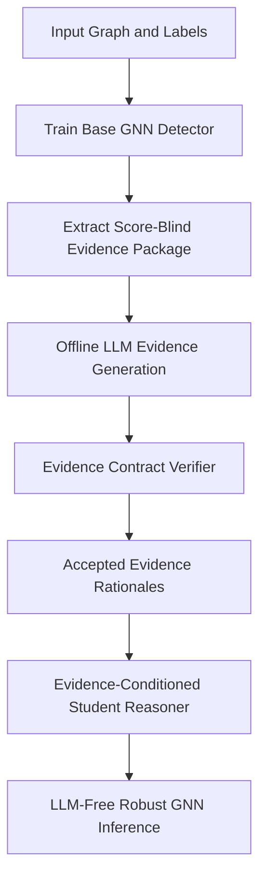

# CoVER: Contract-Verified Evidence Distillation from LLMs for Robust Graph Neural Networks

## IV. Proposed Method

### A. Overview

We propose **CoVER**, a **Contract-Verified Evidence Distillation** framework that transfers LLM-generated structured evidence into lightweight graph neural networks (GNNs) for robust and LLM-free inference. Unlike existing LLM-enhanced graph learning methods that directly rely on free-form rationales, semantic pseudo-labels, or online LLM reasoning, CoVER uses LLMs only as **offline evidence generators**. The generated evidence is not directly trusted. Instead, it must pass explicit evidence contracts before being distilled into a student GNN.

The key motivation behind CoVER is that LLM-generated graph rationales may suffer from three major issues: (i) **topological hallucination**, where the LLM invents unsupported graph evidence; (ii) **score echo**, where the LLM merely verbalizes the base detector's prediction score; and (iii) **unverified rationale noise**, where free-form explanations are treated as supervision without structural validation. To address these issues, CoVER introduces a score-blind evidence interface, a structured evidence rationale schema, a contract verifier, and an evidence-conditioned student reasoner.

CoVER follows a three-stage pipeline:

1. **Base GNN Training.** A base GNN detector is trained on the target graph task.
2. **Offline Evidence Generation and Verification.** A score-blind evidence package is extracted from the trained detector and passed to an LLM teacher. The LLM generates a structured Evidence Rationale Record, which is accepted only if it passes contract verification.
3. **Evidence Distillation.** Accepted evidence rationales are distilled into a lightweight student reasoner. At inference time, CoVER does not call the LLM.

The overall workflow is:



CoVER is task-configurable. In fake review detection, it predicts fraud labels and fraud-related evidence types. In text-attributed graph node classification, it predicts class labels and task-level evidence types. The same contract-verified evidence distillation mechanism is shared across tasks.

---

### B. Problem Formulation

Let $G=(V,E,X)$ be an attributed graph, where $V$ is the node set, $E$ is the edge set, and $X \in \mathbb{R}^{|V| \times d}$ denotes node features. Each labeled training node $v \in V_{\mathrm{train}}$ has a task label $y_v \in \mathcal{Y}$.

For binary graph fraud detection, $\mathcal{Y}=\{0,1\}$, where $1$ denotes fraudulent nodes and $0$ denotes benign nodes. For multi-class node classification, $\mathcal{Y}=\{1,\ldots,C\}$.

A base GNN detector is defined as:

$$f_\theta(G,X,v) \rightarrow (\ell_v^{\mathrm{base}}, z_v)$$

where $\ell_v^{\mathrm{base}}$ denotes the base prediction logits and $z_v \in \mathbb{R}^{h}$ denotes the node representation. For binary tasks, $\ell_v^{\mathrm{base}} \in \mathbb{R}$ or $\mathbb{R}^{1}$. For multi-class tasks, $\ell_v^{\mathrm{base}} \in \mathbb{R}^{C}$.

CoVER aims to learn an evidence-conditioned student reasoner:

$$g_\psi(z_v, \ell_v^{\mathrm{base}}, E_v) \rightarrow (\ell_v^{\mathrm{final}}, \hat{t}_v, \hat{m}_v^+, \hat{m}_v^-)$$

where $\ell_v^{\mathrm{final}}$ is the final task prediction logit, $\hat{t}_v$ is the predicted reason type, and $\hat{m}_v^+$, $\hat{m}_v^-$ are positive and negative evidence masks.

The central objective is to improve the robustness and evidence consistency of GNN predictions while keeping inference LLM-free.

---

### C. Task Specification

To avoid hard-coding CoVER to a specific task, we define a task specification:

$$\mathcal{S}_{\mathrm{task}} = (\mathcal{Y}, C, \mathcal{T}, \mathcal{K}, \mathcal{M})$$

where:

- $\mathcal{Y}$ is the label space;
- $C$ is the number of prediction classes;
- $\mathcal{T}$ is the task-specific reason type set;
- $\mathcal{K}$ is the evidence slot set;
- $\mathcal{M}$ is the evaluation metric set.

For fake review detection, $\mathcal{T}$ may contain:

$$\mathcal{T}_{\mathrm{fraud}} = \{\texttt{structural\_discrepancy},\ \texttt{camouflage\_neighbor},\ \texttt{spectral\_anomaly},\ \texttt{feature\_structure\_conflict},\ \texttt{relation\_or\_burst\_anomaly},\ \texttt{weak\_or\_uncertain\_evidence}\}$$

For text-attributed graph classification, $\mathcal{T}$ may contain:

$$\mathcal{T}_{\mathrm{TAG}} = \{\texttt{semantic\_topic\_match},\ \texttt{citation\_neighbor\_consensus},\ \texttt{semantic\_structure\_conflict},\ \texttt{feature\_structure\_conflict},\ \texttt{attention\_or\_neighbor\_concentration},\ \texttt{weak\_or\_uncertain\_evidence}\}$$

Thus, CoVER is not tied to a single fraud-specific taxonomy. Instead, each task defines its own reason types and evidence contracts.

---

### D. Score-Blind Evidence Interface

#### D.1 Motivation

Directly exposing the base detector's prediction score to an LLM teacher can cause **score echo**, where the LLM explanation merely restates the model's confidence. To prevent this, CoVER constructs a **score-blind evidence package** that separates calibration information from reasoning evidence.

For each node $v$, an evidence adapter extracts a Minimal Evidence Package:

$$A_d(f_\theta, G, X, v) \rightarrow E_v$$

The evidence package contains two channels:

$$E_v = (E_v^{\mathrm{cal}}, E_v^{\mathrm{rea}})$$

where $E_v^{\mathrm{cal}}$ is the calibration channel and $E_v^{\mathrm{rea}}$ is the reasoning channel.

#### D.2 Calibration Channel

The calibration channel contains prediction-related quantities:

```json
{
  "base_score": 0.83,
  "uncertainty": 0.17
}
```

This channel is used only for trace node selection, bucket sampling, and offline analysis. It is removed before constructing the LLM prompt.

#### D.3 Reasoning Channel

The reasoning channel is the only information visible to the LLM teacher. It contains discrete, structured, and verifiable evidence fields:

```json
{
  "degree_level": "high",
  "neighbor_consistency": "low",
  "feature_neighbor_discrepancy": "high",
  "detector_signal": "high_frequency_response_high",
  "detector_signal_strength": "strong",
  "counter_signal": "benign_neighbor_signal_medium",
  "allowed_support_ids": [
    "degree_level",
    "neighbor_consistency",
    "feature_neighbor_discrepancy",
    "detector_signal",
    "detector_signal_strength"
  ],
  "allowed_counter_ids": [
    "counter_signal"
  ]
}
```

The LLM teacher never observes $\ell_v^{\mathrm{base}}$, prediction probabilities, logits, or confidence scores.

Formally, the teacher payload is:

$$P_v = \mathrm{Strip}(E_v) = E_v^{\mathrm{rea}}$$

where $\mathrm{Strip}(\cdot)$ removes all score-related fields.

---

### E. Detector-Evidence Adapter

CoVER uses a detector-evidence adapter to convert internal detector signals into structured evidence:

$$E_v^{\mathrm{rea}} = E_v^{\mathrm{generic}} \cup E_v^{\mathrm{detector}} \cup E_v^{\mathrm{counter}}$$

#### E.1 Generic Evidence

Generic evidence is shared across detectors:

| Evidence Slot                  | Description                                                        |
| ------------------------------ | ------------------------------------------------------------------ |
| `degree_level`                 | Discretized node degree level                                      |
| `neighbor_consistency`         | Agreement between the node and its neighborhood                    |
| `feature_neighbor_discrepancy` | Discrepancy between node features and aggregated neighbor features |
| `uncertainty_level`            | Discretized uncertainty level, not exposed as a raw score          |

#### E.2 Detector-Native Evidence

Detector-native evidence depends on the base model:

| Base GNN        | Detector-Native Evidence                                      |
| --------------- | ------------------------------------------------------------- |
| GCN / GraphSAGE | Message disagreement, embedding-neighbor discrepancy          |
| GAT             | Attention concentration, attention entropy                    |
| BWGNN           | High-frequency response, band-pass activation                 |
| CARE-GNN        | Camouflage-resistant neighbor selection score                 |
| PC-GNN          | Minority-neighbor coverage, imbalance-aware sampling evidence |
| H2GCN / GPR-GNN | Ego-neighbor conflict, propagation disagreement               |

This design allows CoVER to be plugged into multiple base GNNs without requiring the LLM to inspect the full graph.

#### E.3 Counter Evidence

Counter evidence is used to avoid one-sided rationales. Typical counter evidence includes:

| Evidence Slot               | Description                                          |
| --------------------------- | ---------------------------------------------------- |
| `counter_signal`            | Evidence pointing to benign or low-risk behavior     |
| `uncertainty_level`         | High uncertainty as a counterweight to strong claims |
| `neighbor_consistency_high` | Neighborhood agreement that weakens anomaly claims   |

Supporting and counter evidence are explicitly separated.

---

### F. Evidence Rationale Record

The LLM teacher produces a structured **Evidence Rationale Record** (ERR), rather than a free-form explanation:

```json
{
  "reason_type": "spectral_anomaly",
  "supporting_evidence": [
    "detector_signal",
    "neighbor_consistency"
  ],
  "counter_evidence": [
    "counter_signal"
  ],
  "summary": "The node shows strong high-frequency detector evidence and low neighbor consistency, while benign-neighbor evidence is moderate."
}
```

An ERR contains four fields:

| Field                 | Description                                        | Used for Training |
| --------------------- | -------------------------------------------------- | ----------------- |
| `reason_type`         | Task-specific reason type                          | Yes               |
| `supporting_evidence` | Evidence fields supporting the decision            | Yes               |
| `counter_evidence`    | Evidence fields weakening or opposing the decision | Yes               |
| `summary`             | Natural language explanation for audit             | No                |

The summary is retained only for human inspection and is never used in the loss function.

The training targets are:

$$t_v \in \mathcal{T}$$

$$m_v^+ \in \{0,1\}^{K}$$

$$m_v^- \in \{0,1\}^{K}$$

where $K=|\mathcal{K}|$ is the number of evidence slots.

---

### G. Evidence Contract Verifier

#### G.1 Verification Objective

CoVER does not directly trust LLM-generated ERRs. Each ERR must pass an Evidence Contract Verifier:

$$\mathrm{ECV}(R_v, E_v, y_v) \rightarrow a_v \in \{0,1\}$$

Only accepted ERRs with $a_v=1$ are used for evidence distillation.

The verifier is defined as:

$$a_v = V_{\mathrm{schema}} \cdot V_{\mathrm{availability}} \cdot V_{\mathrm{role}} \cdot V_{\mathrm{contract}} \cdot V_{\mathrm{score}} \cdot V_{\mathrm{label}}$$

Each component must be satisfied.

#### G.2 Schema Validity

Schema validity checks whether the ERR has the required structure:

$$V_{\mathrm{schema}} = \mathbb{1}[R_v \text{ is valid JSON}] \cdot \mathbb{1}[t_v \in \mathcal{T}] \cdot \mathbb{1}[m_v^+, m_v^- \text{ are valid evidence sets}]$$

#### G.3 Evidence Availability

Evidence availability requires that every cited evidence field exists in the reasoning channel:

$$V_{\mathrm{availability}} = \mathbb{1}[\forall e \in S_v^+ \cup S_v^-, e \in E_v^{\mathrm{rea}}]$$

where $S_v^+$ and $S_v^-$ are supporting and counter evidence sets.

If an evidence field is unavailable, it cannot be cited.

#### G.4 Role Consistency

Role consistency enforces that supporting and counter evidence follow their predefined roles:

$$V_{\mathrm{role}} = \mathbb{1}[S_v^+ \subseteq \mathcal{K}_v^+] \cdot \mathbb{1}[S_v^- \subseteq \mathcal{K}_v^-] \cdot \mathbb{1}[S_v^+ \cap S_v^- = \emptyset]$$

where $\mathcal{K}_v^+$ and $\mathcal{K}_v^-$ are allowed supporting and counter evidence sets.

For example, `counter_signal` cannot be cited as supporting evidence.

#### G.5 Task-Evidence Contract

For each reason type $t \in \mathcal{T}$, CoVER defines an evidence contract:

$$C_t = (R_t, O_t, F_t)$$

where $R_t$ is the required evidence condition set, $O_t$ is the optional evidence condition set, and $F_t$ is the forbidden evidence condition set.

A required condition $c=(k, \mathcal{V})$ is satisfied only if:

1. the evidence field value matches the contract;
2. the field is explicitly cited as supporting evidence.

Thus:

$$\mathrm{satisfied}(c) = \mathbb{1}[E_v^{\mathrm{rea}}[k] \in \mathcal{V}] \cdot \mathbb{1}[k \in S_v^+]$$

This dual condition prevents hidden compliance, where a correct evidence field exists but is not cited by the LLM.

Example contract for `spectral_anomaly`:

```yaml
spectral_anomaly:
  required_any:
    - field: detector_signal
      values:
        - high_frequency_response_high
        - spectral_energy_shift_high
        - bandpass_response_high
  forbidden:
    - field: detector_signal_strength
      values: [weak]
```

Example contract for `camouflage_neighbor`:

```yaml
camouflage_neighbor:
  required_any:
    - field: neighbor_consistency
      values: [low]
    - field: detector_signal
      values: [camouflage_neighbor_filter_high]
  forbidden:
    - field: neighbor_consistency
      values: [high]
```

#### G.6 Score-Blindness Check

The score-blindness check rejects any ERR that cites score-related fields:

$$V_{\mathrm{score}} = \mathbb{1}[(S_v^+ \cup S_v^-) \cap \mathcal{K}_{\mathrm{score}} = \emptyset]$$

Here $\mathcal{K}_{\mathrm{score}}$ includes prediction scores, probabilities, logits, confidence values, and other score-derived identifiers.

#### G.7 Label Compatibility

For labeled trace nodes, the verifier optionally enforces label compatibility:

$$V_{\mathrm{label}} = \mathbb{1}[t_v \notin \mathcal{F}_{y_v}]$$

where $\mathcal{F}_{y_v}$ is a task-specific set of reason types incompatible with label $y_v$.

For fraud detection, a benign node should not receive a strong fraud-specific reason type unless the contract allows uncertainty or conflict. For TAG classification, label compatibility may be weaker and only prevents semantically impossible reason types.

#### G.8 Scope of Verification

CoVER does not claim that accepted rationales are causally faithful or factually complete. The verifier guarantees only that accepted ERRs are:

- schema-valid;
- evidence-closed;
- role-consistent;
- score-blind;
- contract-consistent;
- label-compatible.

This distinction is important: CoVER verifies evidence contracts, not causal truth.

---

### H. Evidence-Conditioned Student Reasoner

The student reasoner distills accepted ERRs into a lightweight GNN module. Given $z_v$, $\ell_v^{\mathrm{base}}$, and encoded evidence $E_v$, the reasoner outputs:

$$(\ell_v^{\mathrm{final}}, \hat{t}_v, \hat{m}_v^+, \hat{m}_v^-)$$

It consists of four components:

1. Evidence Encoder;
2. Reason Type Head;
3. Signed Evidence Heads;
4. Evidence-Gated Residual Readout.

#### H.1 Evidence Encoder

Each evidence slot is converted into a discrete token. Let:

$$q_v = [q_{v,1}, \ldots, q_{v,K}]$$

be the evidence token sequence. The evidence encoder maps it to a dense evidence representation:

$$g_v = \phi(q_v)$$

Concretely:

$$g_v = \mathrm{LayerNorm}(\mathrm{ReLU}(W_\phi \cdot \mathrm{Flatten}(\mathrm{Embed}(q_v))))$$

This discrete representation aligns the student input with the LLM-visible evidence schema.

#### H.2 Reason Type Prediction

The reason type head predicts the task-specific reason type:

$$\hat{t}_v = h_t([z_v; g_v]) = W_t[z_v; g_v] + b_t$$

Here $\hat{t}_v \in \mathbb{R}^{|\mathcal{T}|}$.

#### H.3 Signed Evidence Mask Prediction

Two independent heads predict supporting and counter evidence masks:

$$\hat{m}_v^+ = \sigma(W_+[z_v; g_v] + b_+)$$

$$\hat{m}_v^- = \sigma(W_-[z_v; g_v] + b_-)$$

The two heads do not share parameters. This allows the model to learn asymmetric patterns for positive and negative evidence.

#### H.4 Evidence-Gated Residual Readout

To ensure that evidence is not merely an auxiliary explanation output, CoVER makes evidence influence the final prediction through a gated residual readout.

First, a raw residual is computed:

$$r_v^{\mathrm{raw}} = \mathrm{MLP}([z_v; g_v])$$

For binary tasks, $r_v^{\mathrm{raw}} \in \mathbb{R}^{1}$. For multi-class tasks, $r_v^{\mathrm{raw}} \in \mathbb{R}^{C}$.

The signed evidence gate is:

$$\alpha_v = \mathrm{mean}(\sigma(\hat{m}_v^+)) - \mathrm{mean}(\sigma(\hat{m}_v^-))$$

The final residual is:

$$r_v = \alpha_v \cdot r_v^{\mathrm{raw}}$$

The final logits are:

$$\ell_v^{\mathrm{final}} = \ell_v^{\mathrm{base}} + \rho\, r_v$$

where $\rho$ is a residual scaling coefficient.

This design preserves the base GNN as the primary predictor while allowing verified evidence to calibrate the prediction.

---

### I. Training Objective

CoVER uses a three-stage training procedure.

#### I.1 Stage 1: Base GNN Training

The base GNN detector is trained with the standard supervised loss:

$$\min_\theta \mathcal{L}_{\mathrm{sup}}(\ell_v^{\mathrm{base}}, y_v)$$

For binary fraud detection:

$$\mathcal{L}_{\mathrm{sup}} = \mathrm{BCEWithLogits}(\ell_v^{\mathrm{base}}, y_v)$$

For multi-class classification:

$$\mathcal{L}_{\mathrm{sup}} = \mathrm{CE}(\ell_v^{\mathrm{base}}, y_v)$$

The trained base GNN is then frozen for evidence extraction and reasoner training.

#### I.2 Stage 2: Offline Evidence Generation and Verification

A trace node set $V_{\mathrm{trace}}$ is selected from the training nodes. For each $v \in V_{\mathrm{trace}}$, CoVER extracts a score-blind evidence package:

$$E_v = A_d(f_\theta, G, X, v)$$

The LLM teacher generates an ERR:

$$R_v = M(P(E_v))$$

The verifier returns:

$$a_v = \mathrm{ECV}(R_v, E_v, y_v)$$

Only accepted ERRs are retained:

$$\mathcal{A} = \{v \in V_{\mathrm{trace}} \mid a_v = 1\}$$

The LLM is used only in this offline stage.

#### I.3 Stage 3: Evidence Distillation

The reasoner is trained with a combination of supervised task loss and evidence distillation loss.

The supervised task loss is computed on all training nodes:

$$\mathcal{L}_{\mathrm{task}} = \frac{1}{|V_{\mathrm{train}}|} \sum_{v \in V_{\mathrm{train}}} \ell_{\mathrm{sup}}(\ell_v^{\mathrm{final}}, y_v)$$

The reason type loss is computed only on accepted ERR nodes:

$$\mathcal{L}_{\mathrm{type}} = \frac{1}{|\mathcal{A}|} \sum_{v \in \mathcal{A}} \mathrm{CE}(\hat{t}_v, t_v)$$

The signed evidence loss is:

$$\mathcal{L}_{\mathrm{evi}} = \frac{1}{|\mathcal{A}|} \sum_{v \in \mathcal{A}} \left[\mathrm{BCE}(\hat{m}_v^+, m_v^+) + \mathrm{BCE}(\hat{m}_v^-, m_v^-)\right]$$

The final objective is:

$$\mathcal{L} = \mathcal{L}_{\mathrm{task}} + \lambda_{\mathrm{evi}} (\mathcal{L}_{\mathrm{type}} + \mathcal{L}_{\mathrm{evi}})$$

If no accepted ERR exists in a mini-batch, the evidence loss is set to zero and the model falls back to supervised training:

$$\mathcal{L} = \mathcal{L}_{\mathrm{task}}$$

This prevents rejected or invalid LLM rationales from contaminating the student model.

---

### J. Inference

At inference time, CoVER does not call the LLM. For each test node $v$:

1. The base GNN computes $\ell_v^{\mathrm{base}}$ and $z_v$.
2. The evidence adapter extracts $E_v^{\mathrm{rea}}$.
3. The student reasoner computes $(\ell_v^{\mathrm{final}}, \hat{t}_v, \hat{m}_v^+, \hat{m}_v^-)$.
4. The prediction is obtained from $\ell_v^{\mathrm{final}}$.
5. The explanation is generated by a deterministic template.

For binary fraud detection:

$$s_v = \sigma(\ell_v^{\mathrm{final}})$$

For multi-class classification:

$$\hat{y}_v = \arg\max_c\, \ell_{v,c}^{\mathrm{final}}$$

A template explanation is:

```text
The prediction is supported by [supporting evidence] and weakened by [counter evidence], with reason type [reason_type].
```

Since the explanation is generated from predicted reason types and evidence masks, no online LLM call is required.

---

### K. Instantiation for Fake Review Detection

In the main application, CoVER is instantiated for fake review detection on YelpChi and Amazon Fraud. The task is binary node classification:

$$y_v \in \{0, 1\}$$

The base GNNs may include GCN, GraphSAGE, GAT, CARE-GNN, PC-GNN, and BWGNN.

The fraud-specific reason types are:

| Reason Type                  | Meaning                                            |
| ---------------------------- | -------------------------------------------------- |
| `structural_discrepancy`     | Abnormal structural pattern                        |
| `camouflage_neighbor`        | Fraudster hides among benign-looking neighbors     |
| `spectral_anomaly`           | High-frequency or band-pass anomaly                |
| `feature_structure_conflict` | Node features conflict with neighborhood structure |
| `relation_or_burst_anomaly`  | Abnormal relation pattern or burst behavior        |
| `weak_or_uncertain_evidence` | Evidence is insufficient or uncertain              |

The main evaluation metrics are AUPRC, ROC-AUC, F1, Recall@K, and Precision@K.

---

### L. Instantiation for Text-Attributed Graphs

To evaluate generalization to LLM-enhanced graph learning settings, CoVER can be instantiated on text-attributed graph node classification benchmarks such as Cora, PubMed, and ogbn-arxiv.

The task becomes multi-class classification:

$$y_v \in \{1, \ldots, C\}$$

The reason types are changed from fraud-specific risk types to task-level evidence types:

| Reason Type                           | Meaning                                             |
| ------------------------------------- | --------------------------------------------------- |
| `semantic_topic_match`                | Text semantics support the predicted class          |
| `citation_neighbor_consensus`         | Citation neighbors agree with the prediction        |
| `semantic_structure_conflict`         | Text and graph structure disagree                   |
| `feature_structure_conflict`          | Node features conflict with neighborhood structure  |
| `attention_or_neighbor_concentration` | Prediction relies on concentrated neighbor evidence |
| `weak_or_uncertain_evidence`          | Evidence is weak or uncertain                       |

This setting enables comparison with LLM-enhanced GNN frameworks such as GIANT, GLEM, LinguGKD, and DuoKD under matched GCN, GAT, and GraphSAGE backbones.

---

### M. Robustness Analysis

CoVER improves GNN robustness from three perspectives.

#### M.1 Robustness Against LLM Noise

Invalid LLM rationales are filtered by the contract verifier. The model only distills accepted ERRs:

$$\mathcal{A} = \{v : a_v = 1\}$$

This avoids treating arbitrary LLM-generated text as reliable supervision.

#### M.2 Robustness Against Score Leakage

Since the teacher payload removes prediction scores and logits, the LLM cannot directly echo the base detector's confidence. Score-blindness is further enforced by the verifier.

#### M.3 Robustness Through Evidence Responsiveness

The evidence-gated residual readout links evidence masks to final predictions. Therefore, modifying supporting evidence should affect the score, reason type, and evidence mask.

A Counterfactual Evidence Consistency test can be used:

$$\mathrm{CEC}_{\mathrm{score}} = \frac{1}{N}\sum_v \mathbb{1}[s_v(E_v) - s_v(E_v^-) > 0]$$

where $E_v^-$ is a weakened evidence package.

Similarly, we evaluate:

$$\mathrm{CEC}_{\mathrm{type}} = \frac{1}{N}\sum_v \mathbb{1}\left[\frac{P(\hat{t}_v = t_v \mid E_v)}{P(\hat{t}_v = t_v \mid E_v^-)} > 0\right]$$

and:

$$\mathrm{CEC}_{\mathrm{evi}} = \frac{1}{N}\sum_v \mathbb{1}\left[\frac{P(\hat{m}_v^+ \mid E_v)}{P(\hat{m}_v^+ \mid E_v^-)} > 0\right]$$

These metrics do not claim causal explanation correctness. They test whether model outputs respond consistently to evidence perturbations.

---

### N. Non-Redundancy Test

To verify that CoVER does not merely reproduce the base score, we test whether the learned reason type and evidence masks contain information beyond the base prediction.

Let:

$$Y = \text{ground-truth label}$$

$$P = \text{base prediction score}$$

$$T = \text{predicted reason type}$$

$$M = \text{predicted evidence mask}$$

The desired condition is:

$$I(T, M; Y \mid P) > 0$$

Empirically, we compare:

```text
AUC(Y ~ P)
AUC(Y ~ P + T)
AUC(Y ~ P + T + M)
```

and:

```text
AUPRC(Y ~ P)
AUPRC(Y ~ P + T)
AUPRC(Y ~ P + T + M)
```

If adding $T$ and $M$ improves performance, the evidence outputs provide non-redundant information beyond the base detector score.

We also report:

```text
corr(base_score, reason_type_confidence)
corr(base_score, evidence_mask_confidence)
```

A very high correlation may indicate score echo.

---

### O. Algorithm

#### Algorithm 1: CoVER Training

```text
Input:
    Graph G=(V,E,X)
    Labels Y
    Base GNN f_theta
    Evidence adapter A_d
    LLM teacher M
    Contract verifier ECV
    Student reasoner g_psi

Stage 1: Train Base GNN
    Train f_theta on V_train using supervised task loss.
    Freeze f_theta.

Stage 2: Offline Evidence Generation
    Select trace nodes V_trace.
    For each node v in V_trace:
        Extract E_v = A_d(f_theta, G, X, v).
        Build score-blind teacher payload P(E_v).
        Generate ERR R_v = M(P(E_v)).
        Verify a_v = ECV(R_v, E_v, y_v).
        If a_v = 1:
            Save R_v as accepted evidence supervision.

Stage 3: Evidence Distillation
    For each training step:
        Compute supervised task loss on all training nodes.
        Compute reason type and signed evidence losses only on accepted ERR nodes.
        Optimize student reasoner g_psi.

Output:
    LLM-free evidence-conditioned robust GNN.
```

#### Algorithm 2: CoVER Inference

```text
Input:
    Test node v
    Trained base GNN f_theta
    Evidence adapter A_d
    Trained student reasoner g_psi

1. Compute base logits and node embedding:
       (l_base, z_v) = f_theta(G, X, v)

2. Extract score-blind reasoning evidence:
       E_v = A_d(f_theta, G, X, v)

3. Run student reasoner:
       (l_final, t_hat, m_pos, m_neg) = g_psi(z_v, l_base, E_v)

4. Generate prediction from l_final.

5. Generate deterministic template explanation from:
       t_hat, m_pos, m_neg

No LLM is called during inference.
```

---

### P. Discussion

CoVER differs from conventional LLM-enhanced GNN approaches in three aspects.

First, CoVER does not treat free-form LLM rationales as direct supervision. It requires the generated rationale to satisfy explicit evidence contracts.

Second, CoVER prevents the LLM from observing base model prediction scores. This reduces score echo and label leakage.

Third, CoVER distills structured evidence into a lightweight student reasoner, enabling LLM-free inference.

CoVER also differs from post-hoc explanation methods such as GNNExplainer and PGExplainer. Post-hoc explainers explain a trained detector after prediction, whereas CoVER uses verified evidence as training supervision and makes evidence masks part of the predictive computation through an evidence-gated residual readout.

---

### Q. Limitations

CoVER verifies whether LLM-generated evidence satisfies predefined contracts, but it does not prove that the evidence is causally faithful. The quality of CoVER depends on the design of evidence schemas and task-specific contracts. If the base detector exposes weak or noisy detector-native signals, the extracted evidence package may be less informative.

In addition, CoVER introduces an offline LLM generation stage, which adds preprocessing cost. However, this cost is not incurred during inference, and prompt caching can be used to avoid repeated LLM calls.

---

## Summary

CoVER provides a contract-verified evidence distillation framework for robust GNNs. It uses LLMs only as offline evidence generators, filters generated rationales through explicit contracts, and distills accepted evidence into a lightweight evidence-conditioned student reasoner. By combining score-blind evidence extraction, structured ERR generation, contract verification, signed evidence supervision, and LLM-free inference, CoVER aims to improve both robustness and interpretability of graph neural networks.
